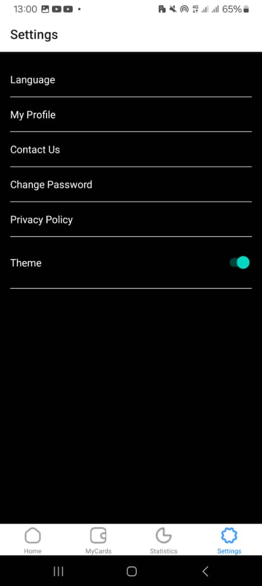

# Project Title

React Native Expo App with Tab Navigation and Theme Toggle

## Description

This React Native mobile application is built using Expo and features two main screens: Home and Settings. The app uses tab navigation to allow users to switch between these screens seamlessly. Additionally, users can toggle between dark and light themes for a personalized experience. The Home screen displays a list of transactions made by the user along with an image of the card used for the transaction. The Settings screen includes standard settings functionalities.

## Features

- **Home Screen**
  - Displays a list of user transactions.
  - Shows an image of the card used for each transaction.
  
- **Settings Screen**
  - Includes typical settings functionalities.
  - Allows users to toggle between dark and light themes.
  
- **Tab Navigation**
  - Enables easy navigation between the Home and Settings screens.

## Technologies Used

- React Native: Framework for building native apps using React.
- Expo: A set of tools and services built around React Native for building, deploying, and quickly iterating on Android, iOS, and web apps.
- React Navigation: Library for routing and navigation in React Native apps.
- Styled Components: Library for styling React Native components with support for theming.

## Installation

1. Clone the repository by using `git clone` followed by the repository URL.
2. Navigate to the project directory using `cd` followed by the project directory name.
3. Install dependencies by running `npm install`.
4. Start the Expo server by running `npm start`.
5. Run the app on an emulator or physical device:
   - For iOS: Press `i` to open in iOS Simulator.
   - For Android: Press `a` to open in Android Emulator.

## Usage

- **Home Screen**
  - View a list of all transactions.
  - See the card image associated with each transaction.
  
- **Settings Screen**
  - Toggle between dark and light themes.
  - Access other standard settings functionalities.

  ## Screenshots
  
*Description of the light theme Home screen screenshot.*

*Description of the dark theme Home screen screenshot.*

*Description of the  Settings screen screenshot.*

## File Structure

- `/components`: Contains all the reusable components.
- `/screens`: Contains the Home and Settings screen components.
- `/navigation`: Contains the tab navigation setup.
- `/theme`: Contains theme-related files and configurations.
- `App.js`: The main entry point of the application.

## Contributing

1. Fork the repository.
2. Create your feature branch (`git checkout -b feature/fooBar`).
3. Commit your changes (`git commit -am 'Add some fooBar'`).
4. Push to the branch (`git push origin feature/fooBar`).
5. Create a new Pull Request.

## Author

- **Name**: Dennis Anim
- **Email**: 11116870
- **GitHub**: [theGeniusDennis](https://github.com/theGeniusDennid)

Thank you for using our app!